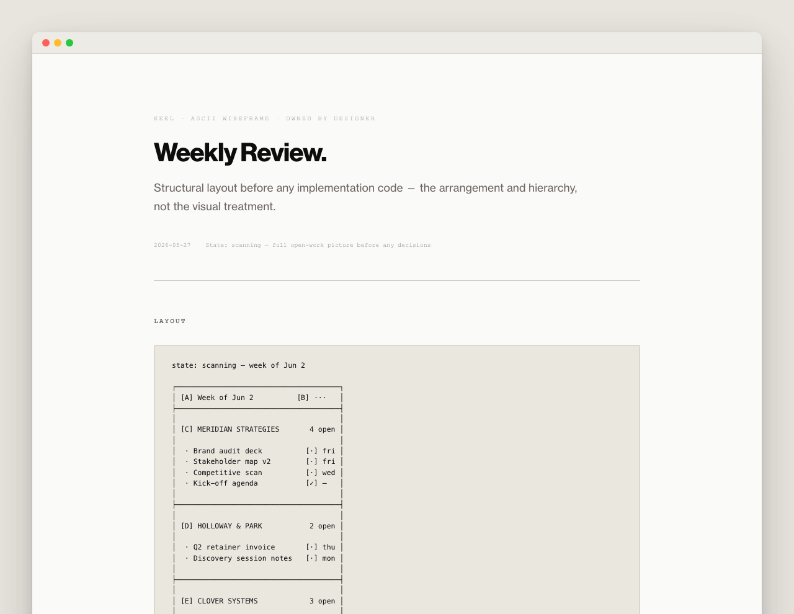
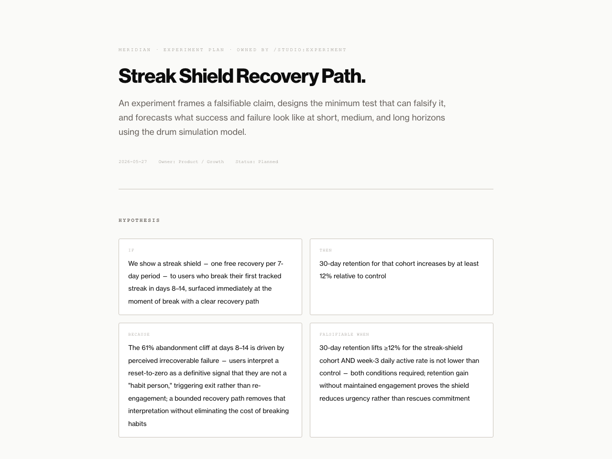
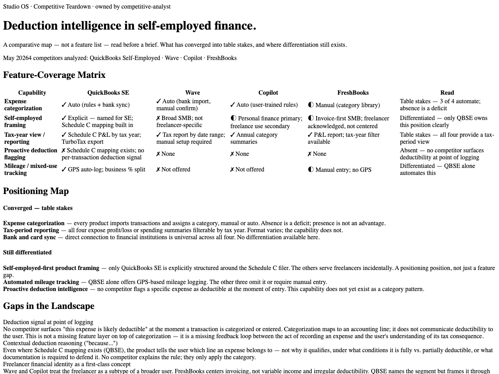
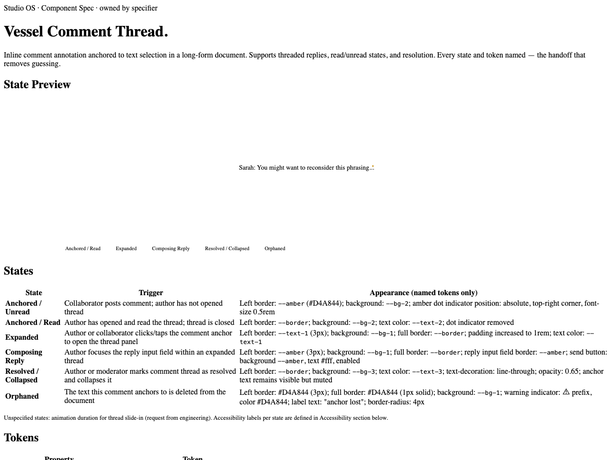
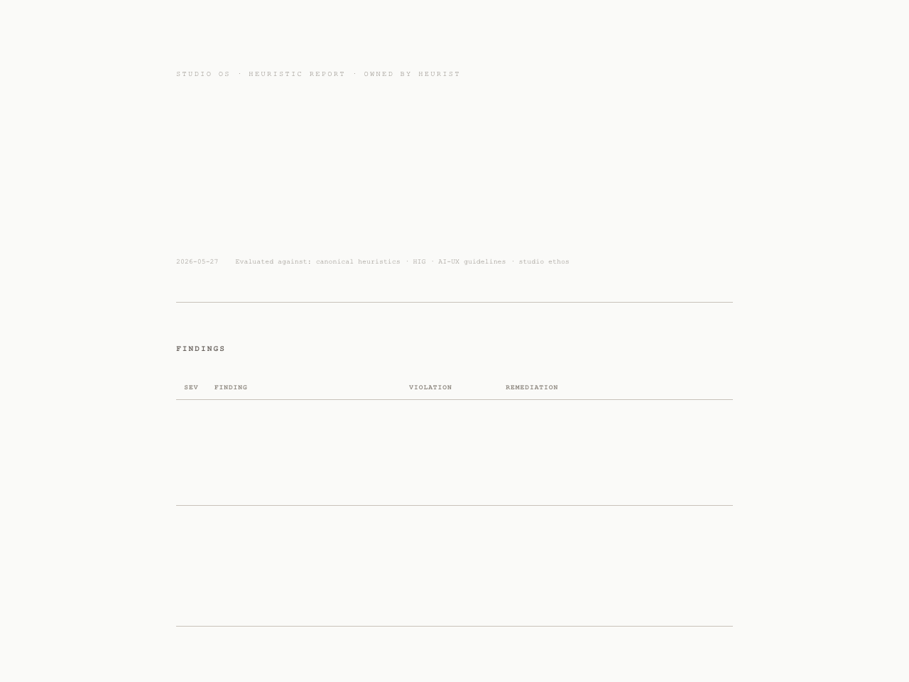

<div align="center"><em>Standard Works · Studio OS</em></div>

---

> Claude Code ships code without a spec. It designs without a brief. It builds before the problem is validated.
> These aren't prompting failures — they're structural: the AI has no senior review, no gate between stages, no accumulated judgment about your product.

Studio OS installs a design studio into Claude Code: 35 discipline agents sequenced by role, with three senior gates that must clear before the next stage can begin.

Product-agnostic. Useful for a solo practitioner; built for a team.

---

## What it produces

<table>
  <tr>
    <td align="center" width="50%">
      
      <br /><sub><b>The interaction model, decided before implementation begins.</b></sub>
    </td>
    <td align="center" width="50%">
      
      <br /><sub><b>A testable hypothesis, structured to falsify — not to confirm.</b></sub>
    </td>
  </tr>
  <tr>
    <td align="center" width="50%">
      
      <br /><sub><b>An open position in the category, surfaced before the brief is written.</b></sub>
    </td>
    <td align="center" width="50%">
      
      <br /><sub><b>All six states documented and named before a line is written.</b></sub>
    </td>
  </tr>
  <tr>
    <td colspan="2" align="center">
      
      <br /><sub><b>The failure modes surfaced — and resolved — before code ships.</b></sub>
    </td>
  </tr>
</table>

---

## How it works

The differentiator is the gate structure. A designer does not run before a strategist and architect have constrained the space. A specifier does not run before a designer has produced an interaction model. Three senior agents hold the line between stages:

> **PM** — the problem gate. Before design begins.
>
> **Creative Director** — the design gate. SHIP / NO-SHIP before engineering begins.
>
> **Distinguished Engineer** — the engineering gate. SHIP / REVISE / REJECT before any merge.

When a verdict requires further work, each gate names the specific agent or skill that resolves it — not just the problem.

<details>
<summary>Studio structure — three tiers</summary>

The studio is organized in three tiers: **Core** (universal craft + the Standard Works philosophy), **Role** (discipline agents), and **Product** (one product's context, which lives in your project, not here).

See [STRUCTURE.md](STRUCTURE.md) for the full tier map and the 35-agent roster.

</details>

---

## Install

Studio OS is a Claude Code plugin.

**From the marketplace:**

```bash
claude plugin marketplace add marktegethoff/studio-os
claude plugin install studio@standard-works
```

Update any time with `claude plugin update studio-os`. Agents and skills are namespaced (`studio:designer`, `/studio:design`) so they never collide with your own.

**Develop / edit-live** (the source becomes the install — edits go live with `/reload-plugins`):

```bash
claude --plugin-dir /path/to/studio-os
```

**Fallback** (non-plugin contexts): `./install.sh` copies agents and skills into `~/.claude/`.

**Then set up product context:**

```
/studio:init
```

This interviews you for your product's purpose, principles, invariants, and stack; scaffolds production and canvas projects with a shared module included by reference; and writes `.claude/memory/project-context.md` — the Product tier. A lint enforces that the shared module is never copied, never published, never forked. Studio OS works without `init` — agents reason without product context. The calibration is what makes the work specific to your product.

---

## Workflow skills

Each workflow leaves behind an artifact the next session can read — a brief, a journey, an interaction model, a spec, a metrics plan — rendered as an HTML document with a built-in feedback harness.

| Command | Produces |
|---|---|
| `/studio:studio` | Entry point — orientation, routing, artifact menu |
| `/studio:init` | Product context setup |
| `/studio:shape` | Shaped brief from interview |
| `/studio:discover` | Problem frame, research, and assumption map |
| `/studio:ideate` | Divergent directions before committing |
| `/studio:design` | Full design workflow |
| `/studio:prototype` | Testable prototype |
| `/studio:handoff` | Production-ready package from prototype |
| `/studio:implement` | Engineering workflow |
| `/studio:measure` | Metrics plan and instrumentation |
| `/studio:experiment` | Experiment design and evaluation plan |
| `/studio:simulate` | *(deprecated — retiring next release; use `/studio:experiment` + `assumption-mapper`)* |
| `/studio:solve` | Convergence loop for hard problems |
| `/studio:review` | Leadership review — PM + CD + DE |
| `/studio:critique` | Single-pass quality review |
| `/studio:simplify` | Codebase coherence pass |
| `/studio:scope` | *(deprecated — merged into `/studio:shape --task`)* |

Discipline agents can be invoked directly by name. Run `/studio:studio` to see what each produces.

---

## Adapting it

Studio OS reflects a specific position on how design and product work should be done — the Standard Works philosophy.

Use it for a few projects. Notice where the principles serve you and where they don't. Then change what needs to change — the agents, the workflows, the philosophy. The point of this system is not to inherit someone else's judgment. It is to build the infrastructure to exercise your own more rigorously.

[Philosophy](PHILOSOPHY.md) · [Examples](EXAMPLES.md)

---

Built by [Mark Tegethoff](https://github.com/marktegethoff) at [Standard Works](https://standardworks.co). The `luck` durability diagnostic was developed by [Soleio](https://github.com/soleio/luck). [Changelog](CHANGELOG.md).
