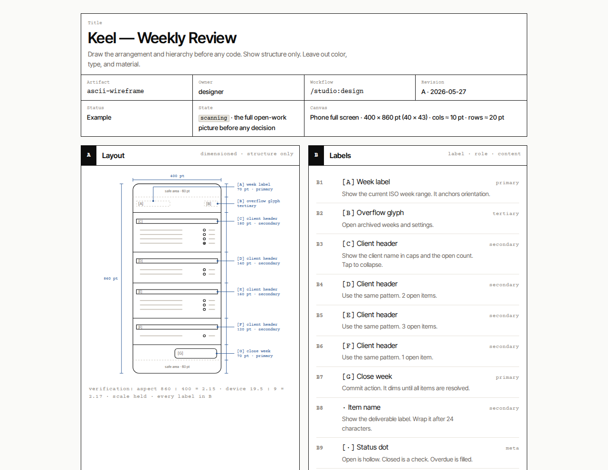
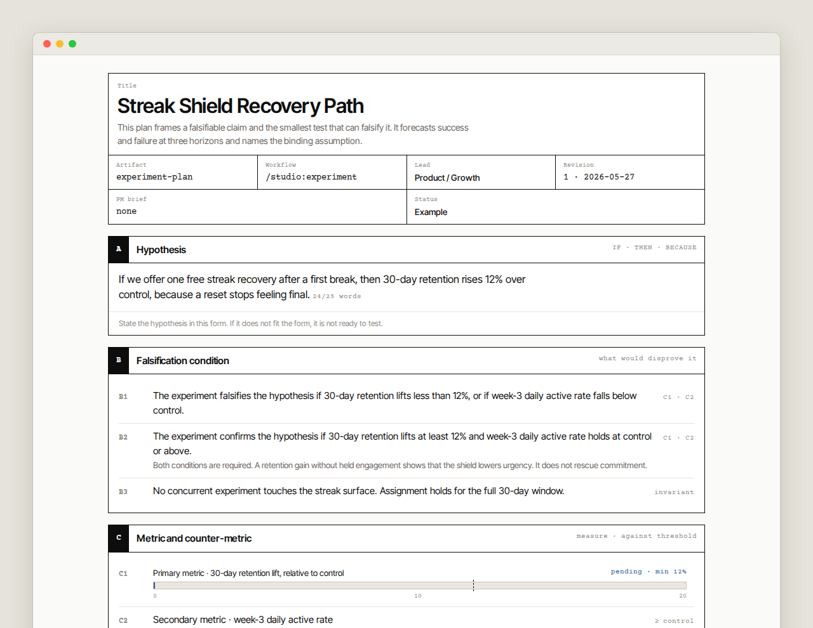
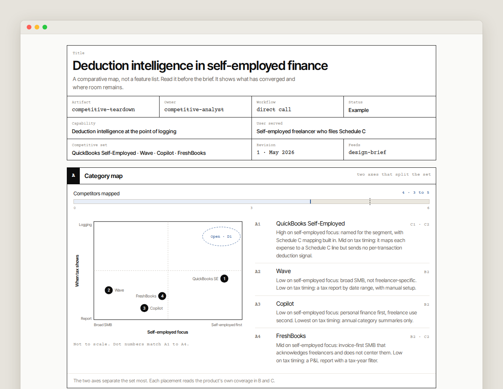
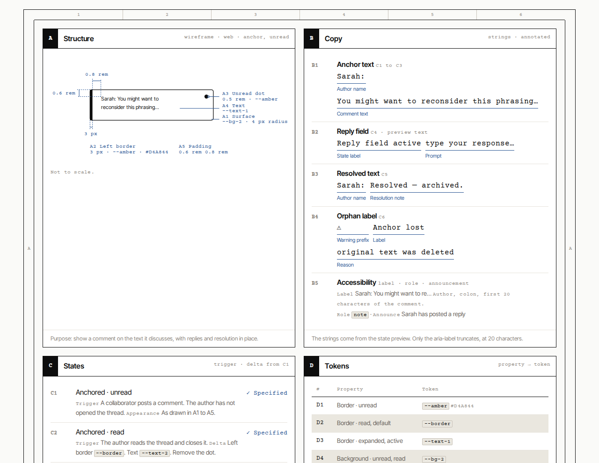
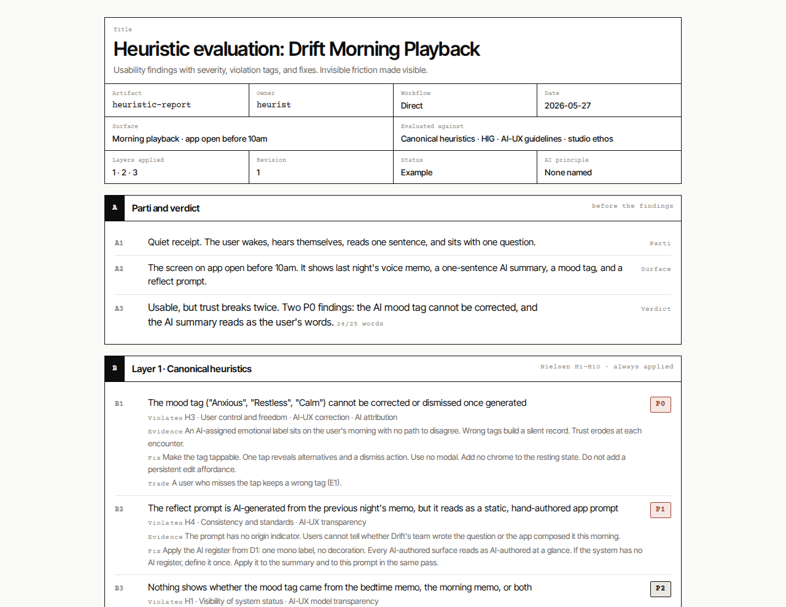

<div align="center"><em>Standard Works · Studio OS</em></div>

---

> Claude Code ships code without a spec. It designs without a brief. It builds before the problem is validated.
> These aren't prompting failures — they're structural: the AI has no senior review, no gate between stages, no accumulated judgment about your product.

Studio OS installs a design studio into Claude Code: 35 discipline agents wired into declared execution graphs, with three senior gates that must clear before the next stage can begin.

Every multi-agent workflow is a **graph** — a lint-validated ` ```graph ` block naming its nodes (agents, gates, human decisions, routers, joins) and edges (sequence, blind fan-out/fan-in, bounded loops), with a `workflow.js` executor where Claude Code's Workflow tool is available and the prose path everywhere else. Human pauses exist only where a real decision is made; ship verdicts must survive a refutation pass; disagreement between disciplines is preserved to the gate, never averaged away. Doctrine lives in `memory/orchestration.md`.

Product-agnostic. Useful for a solo practitioner; built for a team.

---

## What it produces

<table>
  <tr>
    <td align="center" width="50%">
      
      <br /><sub><b>The interaction model, decided before implementation begins.</b></sub>
    </td>
    <td align="center" width="50%">
      
      <br /><sub><b>A testable hypothesis, structured to falsify — not to confirm.</b></sub>
    </td>
  </tr>
  <tr>
    <td align="center" width="50%">
      
      <br /><sub><b>An open position in the category, surfaced before the brief is written.</b></sub>
    </td>
    <td align="center" width="50%">
      
      <br /><sub><b>All six states documented and named before a line is written.</b></sub>
    </td>
  </tr>
  <tr>
    <td colspan="2" align="center">
      
      <br /><sub><b>The failure modes surfaced, each with a remediation, before code ships.</b></sub>
    </td>
  </tr>
</table>

---

## How it works

The differentiator is the gate structure. A designer does not run before a strategist and architect have constrained the space. A specifier does not run before a designer has produced an interaction model. Three senior agents hold the line between stages:

> **PM** — the problem gate. Before design begins.
>
> **Creative Director** — the design gate. SHIP / NO-SHIP before engineering begins.
>
> **Distinguished Engineer** — the engineering gate. SHIP / REVISE / REJECT before any merge.

When a verdict requires further work, each gate names the specific agent or skill that resolves it — not just the problem.

**Since 1.7:** model and effort follow the kind of work — verdict and structure agents (the gates, `architect`, `heurist`) run on Opus at high effort, craft agents on Sonnet at medium, checklist agents on Haiku — and an opt-in `adversary_model` setting runs refutation passes on a stronger, independent model. **Since 1.8:** artifacts are built to read on one page — a title block, lettered panels with citable items, limits drawn as measures, dimensioned wireframes — and each declares a writing genre that `evals/ste-check.sh` checks. Settings: [INSTALL.md § Recommended settings](INSTALL.md#recommended-settings). Detail: [CHANGELOG.md](CHANGELOG.md).

<details>
<summary>Studio structure — three tiers</summary>

The studio is organized in three tiers: **Core** (universal craft + the Standard Works philosophy), **Role** (discipline agents), and **Product** (one product's context, which lives in your project, not here).

See [STRUCTURE.md](STRUCTURE.md) for the full tier map and the 35-agent roster.

</details>

---

## Install

Studio OS is a Claude Code plugin.

**From the marketplace:**

```bash
claude plugin marketplace add marktegethoff/studio-os
claude plugin install studio@standard-works
```

Agents and skills are namespaced (`studio:designer`, `/studio:design`) so they never collide with your own.

**Update:**

```bash
claude plugin marketplace update standard-works
claude plugin update studio@standard-works
```

**Develop / edit-live** (loads the source in place for that session — edits apply with `/reload-plugins`):

```bash
claude --plugin-dir /path/to/studio-os
```

**Fallback** (non-plugin contexts): `./install.sh` copies agents and each skill's `SKILL.md` into `~/.claude/`. It is a reduced install — no namespace, memory, templates, executors, hook, or `adversary_model`. See [INSTALL.md](INSTALL.md).

**Then set up product context:**

```
/studio:init
```

This interviews you for your product's purpose, principles, invariants, system model, and stack, then writes the Product tier under `.claude/memory/`: `project-context.md`, `design-vocabulary.md` (with the dictionary the writing check reads), and your personal `role-context.md`. It also scaffolds production and canvas projects with a shared module included by reference; `evals/lint-agnostic.sh --project <path>` checks that the shared module is wired by path, not by registry. Studio OS works without `init` — agents reason without product context. The calibration is what makes the work specific to your product.

---

## Workflow skills

Each artifact-producing workflow writes a designed HTML document the next session can read — a brief, a journey, an interaction model, a spec, a metrics plan. `/studio:feedback --overlay` marks any of them up.

| Command | Produces |
|---|---|
| `/studio:studio` | Entry point — orientation, routing, artifact menu |
| `/studio:init` | Product context, role calibration, project scaffold |
| `/studio:design-system-init` | A design-system skill for the project — token files and a component directory |
| `/studio:organize` | The project layout — scaffold or reconcile `decisions/`, `specs/`, `design/`, `reviews/` |
| `/studio:shape` | Design brief from an interview; `--task` for a task brief tight enough to delegate |
| `/studio:discover` | Research, user journey, assumption register, and brief |
| `/studio:ideate` | Divergent directions, each with a forcing tradeoff, before committing |
| `/studio:design` | Full design workflow — brief through validated interaction model |
| `/studio:prototype` | Testable prototype and prototype brief |
| `/studio:handoff` | Production-ready package from a prototype — state inventory and component spec |
| `/studio:implement` | Engineering workflow — spec through verified build |
| `/studio:measure` | Metrics plan and instrumentation |
| `/studio:experiment` | Experiment plan — hypothesis, metric, falsification condition |
| `/studio:solve` | Convergence loop for hard design problems |
| `/studio:troubleshoot` | Convergence loop for hard engineering problems — Architect, stack engineers, DE verdict |
| `/studio:review` | Leadership review — PM + CD + DE |
| `/studio:critique` | Nine-discipline findings and triage, no verdict |
| `/studio:simplify` | Codebase coherence pass |
| `/studio:feedback` | Structured feedback — a Review Surface (`--surface`) or a click-to-annotate overlay (`--overlay`) |

Session and quality skills:

| Command | Produces |
|---|---|
| `/studio:studio-slop` | Quality floor — tests output for the seven slop markers |
| `/studio:studio-drift` | Drift diagnostic — finds stale or contradicting decisions and routes each to a gate |
| `/studio:studio-postmortem` | Post-ship retrospective — a failure becomes a Named Ban or a precedent |
| `/studio:studio-close` | Session close — proposes memory deposits; writes nothing unconfirmed |

Deprecated, kept for redirects: `/studio:scope` → `/studio:shape --task` · `/studio:annotate` → `/studio:feedback --overlay` · `/studio:gather-feedback` → `/studio:feedback --surface` · `/studio:simulate` → `/studio:experiment` + `assumption-mapper` · `/studio:luck` → the `luck` agent.

Discipline agents can be invoked directly by name. Run `/studio:studio` to see what each produces.

---

## Adapting it

Studio OS reflects a specific position on how design and product work should be done — the Standard Works philosophy.

Use it for a few projects. Notice where the principles serve you and where they don't. Then change what needs to change — the agents, the workflows, the philosophy. The point of this system is not to inherit someone else's judgment. It is to build the infrastructure to exercise your own more rigorously.

[Philosophy](PHILOSOPHY.md) · [Examples](EXAMPLES.md)

---

Built by [Mark Tegethoff](https://github.com/marktegethoff) at [Standard Works](https://standardworks.co). The `luck` durability diagnostic was developed by [Soleio](https://github.com/soleio/luck). [Changelog](CHANGELOG.md).
