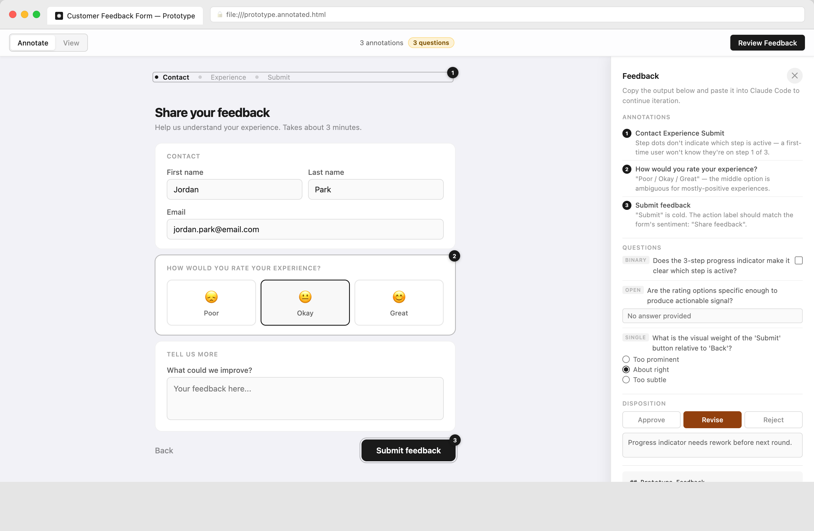

# Annotate

A Claude Code skill that turns any HTML prototype into a click-to-annotate feedback surface. Produces structured Markdown output formatted for direct use in Claude Code prompts.



## Usage

From any Claude Code session:

```
/annotate path/to/prototype.html
```

Produces `prototype.annotated.html` in the same directory. Open in any browser — no server required.

### With a brief

```
/annotate path/to/prototype.html --brief path/to/brief.md
```

Reads the brief and generates 2–4 structured questions specific to the problem and user it describes. Questions are typed: binary (yes/no), open-ended, single-select, or multi-select.

If a `product_brief_*.md` file exists in the current working tree, it is used automatically — no `--brief` flag needed.

### With custom questions

```
/annotate path/to/prototype.html --questions ["Is the hierarchy clear?", "Does the empty state explain itself?"]
```

Custom questions are added alongside any brief-derived questions.

## How it works

1. Open the annotated file in a browser
2. Click any element to attach a comment — a popover appears at click position
3. Click the same element again to edit or remove the annotation
4. Numbered pins appear on annotated elements
5. Click "Review Feedback" to open the panel — answer questions, set a disposition (Approve / Revise / Reject), and copy the output

## Output format

```markdown
## Prototype Feedback
**File:** prototype.html  ·  **Session:** May 3, 2026
**Disposition:** REVISE — Progress indicator needs rework

### [1] Contact Experience Submit
**Selector:** `div.proto-progress`
**Feedback:** Step dots don't indicate which step is active.

### [2] Submit feedback
**Selector:** `#submit-btn`
**Feedback:** "Submit" is cold — consider "Share feedback".

### Questions
**[Q1 — Binary]** Does the 3-step progress indicator make the current step clear?
→ UNADDRESSED

**[Q2 — Open-ended]** Are the rating options specific enough to produce actionable signal?
→ No answer provided

---
*2 annotations. Paste this block directly into your Claude Code prompt.*
```

## Notes

- The source file is never modified — output is always `[name].annotated.html`
- Annotations persist in `localStorage` keyed by file path — reopening restores them
- Re-running `/annotate` on an already-annotated file updates questions without losing annotations
- No external dependencies — works offline, no CDN, no build step
